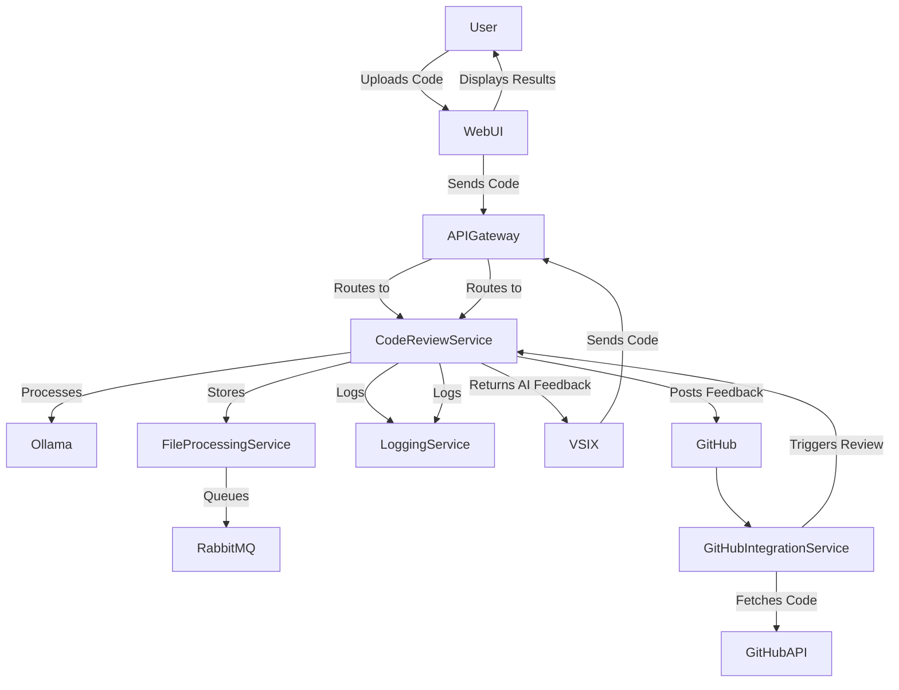

# AI Code Review Tool

## Overview
This project provides an AI-powered code review tool with multiple integrations:
- **Web-Based UI** for uploading and reviewing code
- **Visual Studio Extension** for seamless integration with VS
- **GitHub Integration** to automate code reviews in repositories

## Microservices Architecture

| Project Name               | Microservice Name                  | Project Type                                    |
|----------------------------|-----------------------------------|------------------------------------------------|
| APIGateway                 | API Gateway                        | ASP.NET Core Web API (Ocelot)                   |
| CodeReviewService          | Code Review Service               | ASP.NET Core Web API (Ollama)                   |
| FileProcessingService      | File Processing Service           | ASP.NET Core Web API (RabbitMQ)                 |
| GitHubIntegrationService   | GitHub & VS Integration Service  | ASP.NET Core Web API (GitHub API)               |
| AuthService                | Authentication Service            | ASP.NET Core Identity (OAuth2.0)                |
| LoggingService             | Logging & Monitoring Service      | ASP.NET Core Web API (Serilog, Prometheus)      |

## Features

### Web-Based Code Review
1. Setup ASP.NET Core Backend
2. Implement API for text input
3. Implement API for multiple file uploads
4. Integrate Ollama for AI Code Review

### Visual Studio Extension
1. Create VSIX Project in Visual Studio
2. Add a custom command to send code for review
3. Call API from VSIX to send the active document
4. Display AI feedback in Visual Studio

### GitHub Integration
1. Set up GitHub Webhooks to trigger reviews
2. Use GitHub API to fetch code from repositories
3. Post AI feedback as PR comments
4. Automate reviews in GitHub Actions

## Open Source AI Models for Code Review
- **Code Llama** (Meta)
- **StarCoder** (BigCode)
- **WizardCoder** (WizardLM)
- **Phi-2** (Microsoft)
- **SantaCoder** (BigCode)

## Architecture Diagram

## Getting Started
### Prerequisites
- .NET 8
- Docker
- RabbitMQ
- Ollama AI Model
- GitHub API Access

### Installation
1. Clone the repository
2. Configure environment variables
3. Run `docker-compose up`

### API Endpoints
- `POST /api/review` - Submit code for review
- `GET /api/review/{id}` - Get review results
- `POST /api/github/webhook` - GitHub Webhook for auto-reviews

## Contributing
Contributions are welcome! Open an issue or submit a pull request.

## License
This project is licensed under the MIT License.

